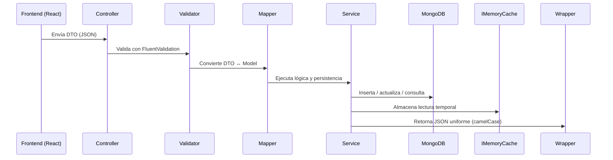

# RealEstate.API — Plataforma de Gestión Inmobiliaria


> **RealEstate.API** es una solución modular de software para gestión inmobiliaria basada en **ASP.NET Core 9 + React + MongoDB Atlas**, con arquitectura limpia, validaciones centralizadas, autenticación JWT y respuesta unificada de servicios.

---

## Descripción General

Sistema completo para **administrar propiedades, dueños, imágenes y trazas de historial** dentro de un ecosistema seguro y escalable.  
Integra frontend y backend de forma desacoplada, con:

- **API REST modular**
- **Frontend React + Redux Toolkit**
- **MongoDB Atlas** como base de datos principal
- **JWT Authentication** + Refresh Tokens
- **FluentValidation + AutoMapper**
- **IMemoryCache** con TTL configurable
- **ServiceResultWrapper<T>** para respuestas estandarizadas
- **Middlewares** personalizados de logging y errores

---

## Módulos Principales

| Módulo | Descripción |
|:--|:--|
| **Auth** | Autenticación JWT, registro, login y refresh tokens. |
| **User** | CRUD completo de usuarios, roles y contraseñas hasheadas (BCrypt). |
| **Owner** | Administración de dueños de propiedades. |
| **Property** | CRUD con filtros, paginación, caché y validaciones. |
| **PropertyImage** | Gestión de imágenes asociadas (Base64 o URL). |
| **PropertyTrace** | Historial de eventos de propiedades (compra, arriendo, mejora). |
| **Password** | Recuperación y restablecimiento de contraseñas vía correo SMTP. |

---

## Estructura del Proyecto

```bash
RealEstate.API/
├── Modules/
│   ├── Auth/
│   │   ├── Controller/
│   │   ├── Service/
│   │   ├── Dto/
│   │   ├── Interface/
│   │   ├── Validator/
│   │   └── Interfaces/
│   ├── User/
│   │   ├── Controller/
│   │   ├── Service/
│   │   ├── Dto/
│   │   ├── Interface/
│   │   ├── Mapper/
│   │   ├── Model/
│   │   └── Validator/
│   ├── Owner/
│   │   ├── Service/
│   │   ├── Dto/
│   │   ├── Interface/
│   │   ├── Mapper/
│   │   ├── Model/
│   │   └── Validator/
│   ├── Property/
│   │   ├── Controller/
│   │   ├── Service/
│   │   ├── Dto/
│   │   ├── Interface/
│   │   ├── Mapper/
│   │   ├── Model/
│   │   └── Validator/
│   ├── PropertyImage/
│   │   ├── Service/
│   │   ├── Dto/
│   │   ├── Interface/
│   │   ├── Mapper/
│   │   ├── Model/
│   │   └── Validator/
│   ├── PropertyTrace/
│   │   ├── Service/
│   │   ├── Dto/
│   │   ├── Interface/
│   │   ├── Mapper/
│   │   ├── Model/
│   │   └── Validator/
│   └── Password/
│   │   ├── Controller/
│   │   ├── Service/
│   │   ├── Dto/
│   │   ├── Interface/
│   │   ├── Mapper/
│   │   ├── Model/
│   │   └── Validator/
├── Infraestructure/
│   ├── Core/
│   │   ├── Logs/
│   │   └── Services/
├── Middleware/
│   ├── LoggingMiddleware.cs
│   ├── ErrorHandlerMiddleware.cs
├── Mappings/
│   └── MappingProfile.cs
├── Program.cs
└── README.md
```

---

## Flujo General de Datos

1. Frontend (React) → Axios
2. DTO → Validator (FluentValidation) → Mapper → Model
3. MongoDB (persistencia)

---

## Flujo de Procesamiento



---

## Componentes Clave

### `ServiceResultWrapper<T>`
Estandariza todas las respuestas del backend:

```json
{
  "success": true,
  "statusCode": 200,
  "message": "Operación exitosa",
  "data": { },
  "errors": []
}
```

### `LoggingMiddleware`
Registra cada request con método, endpoint, tiempo de ejecución y estado HTTP.

### `ErrorHandlerMiddleware`
Captura excepciones globales y las transforma en una respuesta JSON clara.

---

## Autenticación y Autorización (JWT)

- **JwtService** genera tokens de acceso y refresh.
- Tokens incluyen claims: `sub`, `email`, `role`.
- Roles disponibles:  
  - `user` — acceso básico  
  - `editor` — permisos de edición  
  - `admin` — control total del sistema  

| Método | Restricción | Roles |
|:--|:--|:--|
| GET | Lectura general | Todos |
| POST | Crear entidades | Autenticado |
| PUT / PATCH | Modificar | `editor`, `admin` |
| DELETE | Eliminar | `admin` |

---

## Caché IMemoryCache

- TTL configurado con `CACHE_TTL_MINUTES` (por defecto 5 min).  
- Invalida automáticamente al modificar entidades.
- `?refresh=true` permite omitir el caché en lecturas.

Módulos con caching activo:  
#### Property · Owner · PropertyImage · PropertyTrace · User

---

## Variables de Entorno

```dotenv
#DEV
PORT=5235
#FRONTEND_URL=http://localhost:3001/realestate.app

#PROD
FRONTEND_URL=https://user.github.io/realestate.app

# MongoDB
MONGO_CONNECTION=mongodb+srv://...
MONGO_DATABASE=RealEstate
MONGO_COLLECTION_PROPERTY=Property
MONGO_COLLECTION_OWNER=Owner
MONGO_COLLECTION_PROPERTYIMAGE=PropertyImage
MONGO_COLLECTION_PROPERTYTRACE=PropertyTrace
MONGO_COLLECTION_USER=User

# JWT
JWT_SECRET=XXXXXXXXXXXXXXXXXXXXXXXX
JWT_ISSUER=RealEstateAPI
JWT_AUDIENCE=UsuariosAPI
JWT_EXPIRY_MINUTES=60
JWT_REFRESH_DAYS=7

# Cache TTL (minutos)
CACHE_TTL_MINUTES=5

# SMTP (para recuperación de contraseñas)
SMTP_HOST=smtp.gmail.com
SMTP_PORT=587
SMTP_USER=no-reply@example.com
SMTP_PASS=xxxxxxxxxxxx
```

---

## Seguridad

- Contraseñas hasheadas con **BCrypt.Net**
- Tokens JWT firmados con clave simétrica (`JWT_SECRET`)
- CORS “AllowAll” solo en desarrollo
- Compatible con HTTPS y TLS (Atlas SRV)

---

## Ejecución Local

### Backend
```bash
dotnet build
dotnet run --project RealEstate.API.csproj
```
- API: `https://localhost:5235`

### Frontend
```bash
cd RealEstate.App
npm install
npm run dev
```
- App: `http://localhost:5173`


---

## Diagrama de Flujo Interno

```mermaid
graph TD
  F[Frontend React] -->|Axios| C[Controller .NET]
  C --> V[Validator (FluentValidation)]
  V --> M[Mapper (AutoMapper)]
  M --> S[Service]
  S --> DB[(MongoDB Atlas)]
  S --> Cache[IMemoryCache]
  S --> JWT[JwtService]
  C -->|Wrapper JSON (camelCase)| R[Response]
```

---

## Tecnologías

| Capa | Tecnología | Descripción |
|------|------------|-------------|
| Frontend | React + Vite | UI moderna y modular |
| Backend | ASP.NET Core 9 | API REST limpia y escalable |
| BD | MongoDB | Almacenamiento NoSQL |
| Auth | JWT + BCrypt.Net | Seguridad y autenticación |
| Validación | FluentValidation | Validación de DTOs |
| Mapper | Manual + normalización | Sincronización camelCase / PascalCase |


---

## Versión y Estado

| Componente | Versión | Estado |
|-------------|----------|--------|
| Backend (.NET) | 9.0 | Estable |
| Frontend (React) | 18+ | Estable |
| MongoDB | Atlas / Local | Conectado |
| Cache | IMemoryCache | Activo |
| JWT Auth | Activo | |
| FluentValidation | Integrado | |
| AutoMapper | Configurado | |
| PasswordService | SMTP Ready | Opcional |

---

## Convenciones de API

- Casing JSON: camelCase en toda la API.
- Respuestas de error (wrapper):
  - Estructura: `{ success: false, StatusCode, message, errors: string[], data: null }`.
  - Aplicado a errores globales, ModelState/binding, ValidationException y status sin cuerpo (404/405/415).
- Respuestas de éxito:
  - Property: devuelve wrapper `{ success: true, statusCode, message, data, errors: [] }`.
  - Otros módulos: éxito devuelve DTO plano.

Ejemplo de validación (400):

```json
{
  "success": false,
  "statusCode": 400,
  "message": "Errores de validación",
  "errors": [
    "El nombre de la propiedad es obligatorio",
    "El precio debe ser mayor a 0"
  ],
  "data": null
}
```

---

## Ejecución Local

- Backend
  - `dotnet build`
  - `dotnet run --project RealEstate.API.csproj`
- Frontend
  - `cd RealEstate.App && npm install && npm run dev`

Acceso por defecto:
- API: `http://localhost:5235`
- App: `http://localhost:3001`

---

## Endpoints por Módulo

### Property
- `GET /api/property?name&address&idOwner&minPrice&maxPrice&page=1&limit=6&refresh=false`
- `GET /api/property/{id}`
- `POST /api/property` (JSON) → 201 Created con wrapper
- `PATCH /api/property/{id}`
- `DELETE /api/property/{id}`

Ejemplo de creación (request):

```json
{
  "name": "Casa 123",
  "address": "Calle 1 #2-3",
  "price": 250000,
  "codeInternal": 123,
  "year": 2020,
  "Owner": {
    "name": "Casa 123",
    "address": "Calle 1 #2-3",
    "birthday": "1970-10-10"
  },
  "Image": {
    "file": "<Imagen Base64>",
    "enabled": true,
  },
  "Traces": [{
    "name": "Venta",
    "datesale": "2000-01-01",
    "value": 350000000,
    "tax": 10
  }],
}
```

Respuesta (201):

```json
{
  "success": true,
  "statusCode": 201,
  "message": "Propiedad creada exitosamente",
  "data": {
    "idProperty": "...",
    "name": "Casa 123",
    "address": "Calle 1 #2-3",
    "price": 250000,
    "codeInternal": 123,
    "year": 2020,
    "idOwner": "64f0c5d8a1b2c3d4e5f67890"
  },
  "errors": []
}
```

### User
- `GET /api/user?refresh=false` (protegido)
- `GET /api/user/{email}?refresh=false` (protegido)
- `POST /api/user`
- `PUT /api/user/{email}` (protegido)
- `PATCH /api/user/{email}` (protegido)
- `DELETE /api/user/{email}` (protegido)

Ejemplo de actualizacion parcial (PATCH):

```json
{
  "name": "Jane Doe",
  "role": "editor"
}
```

Ejemplo de registro (request):

```json
{
  "name": "John Doe",
  "email": "john@example.com",
  "password": "Secret123!",
  "role": "user"
}
```

Respuesta (201):

```json
{
  "name": "John Doe",
  "email": "john@example.com",
  "role": "user"
}
```

### Auth
- `POST /api/auth/register`
- `POST /api/auth/login`
- En endpoints protegidos usar `Authorization: Bearer <TOKEN>`.

Ejemplo de login (request):

```json
{
  "email": "john@example.com",
  "password": "Secret123!"
}
```

Respuesta (200):

```json
{
  "token": "<JWT>"
}
```

---

## Caché por Módulo

- Implementación: IMemoryCache para listados/consultas frecuentes.
- TTL: `CACHE_TTL_MINUTES` (fallback 5 min).
- refresh: `refresh=true` omite lectura/escritura en caché para obtener datos frescos.

Módulos con caché:
- Property: `GET /api/property` (paginado/filtrado).
- User: `GET /api/user`, `GET /api/user/{email}` (lecturas no sensibles).

Recomendaciones de TTL:
- Dev/QA: TTL bajo (1) o usa `refresh=true` tras mutaciones.
- Prod: Property/Trace 5–10 min, Owner/Image/User 2–5 min según uso.

---

## Middleware

- Logging: request/response con tiempos y cuerpos (POST/PUT/PATCH).
- Errores: captura global y respuesta unificada (wrapper).
- StatusCodePages: wrapper también para 404/405/415.

---

## Integración Cliente (Axios)

- En success: Property devuelve la respuesta del wrappers el cliente debe hacer “unwrap” a `data` para obtener los DTOs.
- En errors: siempre lee `error.response.data` (formato amigable documentado arriba).

---

## Notas de Seguridad

- CORS "AllowAll" solo para desarrollo. En producción usar `WithOrigins`/dominios permitidos.
- No publicar `.env` con secretos reales. Usar `.env.example` y variables de entorno seguras.

---

## Autorizacion y Roles

Para endpoints protegidos enviar siempre el header `Authorization: Bearer <TOKEN>`.

Roles disponibles: `user`, `editor`, `admin`.

| Operacion | Requisito |
|-----------|-----------|
| GET | Publico, excepto `GET /api/user...` (requiere token) |
| POST | Autenticado (cualquier rol) |
| PUT | Roles `editor,admin` |
| PATCH | Roles `editor,admin` |
| DELETE | Rol `admin` |

Notas:
- El claim de rol usa `ClaimTypes.Role` dentro del JWT.
- Las reglas aplican a todos los modulos salvo donde se indique explicitamente lo contrario.

---

## Password

- `POST /api/password/recover` (anónimo)
  - Body: `{ "email": "user@example.com" }`
  - Envía email con enlace de recuperación si SMTP está configurado. Siempre responde 200 en dev.
- `GET /api/password/reset/{token}` (anónimo)
  - Verifica token y devuelve `{ message, id }` si es válido.
- `PATCH /api/password/update` (anónimo)
  - Body: `{ "token": "<JWT>", "newPassword": "Secret123!" }`
  - Actualiza password del usuario (hash con BCrypt). Token válido 15 min.

Configuración SMTP para envío del correo de reset de la contraseña:

```dotenv
SMTP_HOST=smtp.example.com
SMTP_PORT=587
SMTP_USER=no-reply@example.com
SMTP_PASS=xxxxxxxxxxxxx
```

---

## Base de Datos MongoDB

- Colecciones: `User`, `Owner`, `Property`, `PropertyImage`, `PropertyTrace`
- Indexación:
  ```bash
  db.user.createIndex({ Email: 1 }, { unique: true })
  db.property.createIndex({ idOwner: 1 })
  db.property.createIndex({ price: 1 })
  ```

- `ObjectId` representado como `string` (BSON compatible)
- Configuración inyectada desde `IConfiguration`
- La API usa MongoDB vía `MongoDB.Driver` con estas variables:
  - `MONGO_CONNECTION` SRV
  - `MONGO_DATABASE` (`RealEstate`)
  - Colecciones por módulo:
    - `MONGO_COLLECTION_PROPERTY`
    - `MONGO_COLLECTION_OWNER`
    - `MONGO_COLLECTION_PROPERTYIMAGE`
    - `MONGO_COLLECTION_PROPERTYTRACE`
    - `MONGO_COLLECTION_USER`
- El arranque registra:
  - `IMongoClient` como singleton con `MONGO_CONNECTION`.
  - `IMongoDatabase` como singleton con `MONGO_DATABASE`.
- Cada servicio resuelve su colección leyendo el nombre desde `IConfiguration`.
  - Ejemplo: `OwnerService` usa `MONGO_COLLECTION_OWNER`; `UserService` usa `MONGO_COLLECTION_USER`.

Modelo de datos

- Identificadores: las entidades usan `string` para `Id`, mapeado a `ObjectId` con atributos BSON.
- Convenciones BSON: se usan `[BsonId]`, `[BsonRepresentation(BsonType.ObjectId)]` y `[BsonElement("...")]` para mantener nombres coherentes entre C# y MongoDB.

Buenas prácticas e índices recomendados

- Unicidad de usuarios: índice único en `Email` de la colección de usuarios.
- Búsquedas comunes: índices en campos filtrables (p. ej., `Property.idOwner`, `Property.price`, `Owner.name`).
- Ejemplo (Mongo Shell):
  - `db.user.createIndex({ Email: 1 }, { unique: true })`
  - `db.property.createIndex({ idOwner: 1 })`
  - `db.property.createIndex({ price: 1 })`

Ejemplos de cadena de conexión

```bash
# Autenticación usuario/clave (base admin) + opciones de pool/timeout
# SRV (Atlas) con TLS implícito
MONGO_CONNECTION=mongodb+srv://<bd_user>:<bd_password>@cluster0.xxxxx.mongodb.net
```

Notas operativas

- Caché en memoria: las lecturas se almacenan con TTL configurable (`CACHE_TTL_MINUTES`).
  - Los servicios invalidan la caché correspondiente en operaciones de escritura.
  - El parámetro `refresh=true` fuerza omitir la caché en lecturas.

- TLS/SSL: SRV (Atlas) ya usa TLS; para `mongodb://` on-prem, habilitar TLS según tu despliegue.

---

## Pruebas Unitarias

- **Frameworks:** `NUnit`, `Moq`, `FluentAssertions`
- **Cobertura recomendada:**
  - Controladores (Auth, User, Property, Password)
  - Servicios (Auth, User, Property, Owner, PropertyImage, PropertyService, Password)
  - Validadores (DTO)
  - Seguridad (JWT generation / refresh)
  - Cache (hit/miss y refresh)
  - Reglas de roles

Ejemplo de test unitario:
```csharp
[Test]
public async Task Login_ShouldReturnToken_WhenCredentialsValid()
{
    var result = await _authService.LoginAsync(validLoginDto);
    result.Success.Should().BeTrue();
    result.Data.Should().NotBeNull();
}
```

---

## Licencia

Este proyecto se distribuye bajo licencia **MIT**.  
Puedes usarlo, modificarlo y redistribuirlo libremente con atribución.

---

## Autor

**Jorge Luis Muñoz Pabón**  
Full Stack Developer – .NET · React · MongoDB  
[GitHub: @jorgelmunozp](https://github.com/jorgelmunozp)